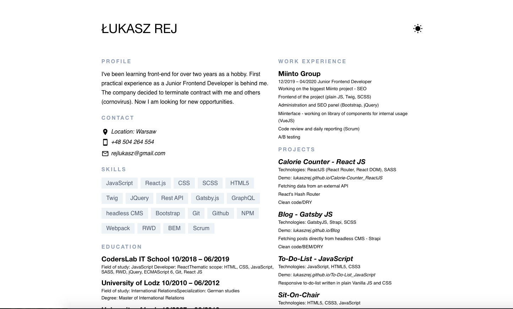
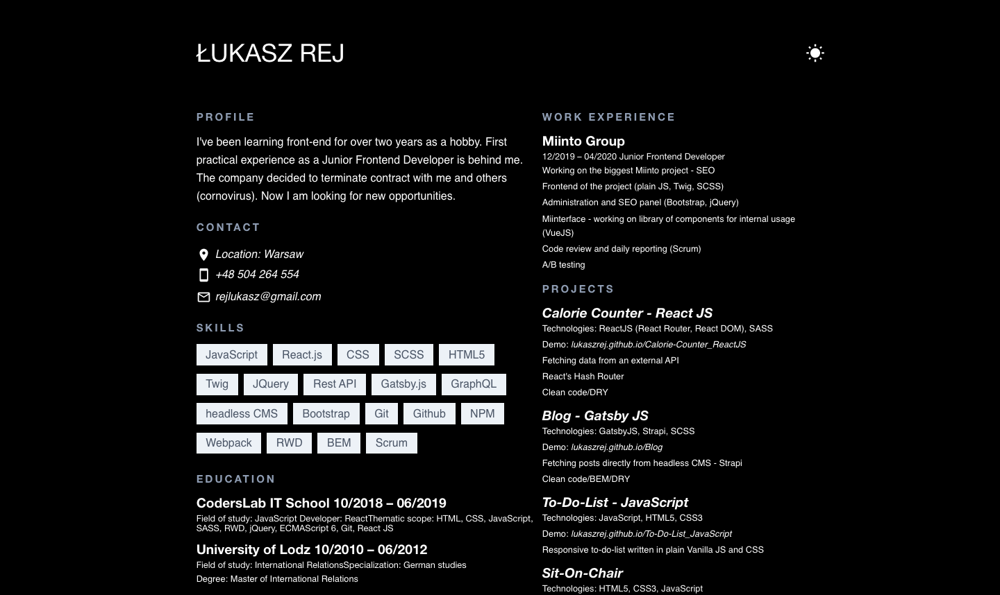

# Resume

### Demo :rocket:
[Demo here](https://lukaszrej.github.io/Resume/)

### Technologies used for this project

- [React](https://reactjs.org/) (with hooks)
- [GatsbyJS](https://www.gatsbyjs.org/)
- [Styled-components](https://styled-components.com/)

## Description

The project is a simple webpage with my resume.

### Configuration of the project

- clone the repo and navigate to the directory
- install node modules ```$ npm i```
- start Gatsby using ```$ gatsby develop```
- see the result on the ```http://localhost:8000/```

## Preview




